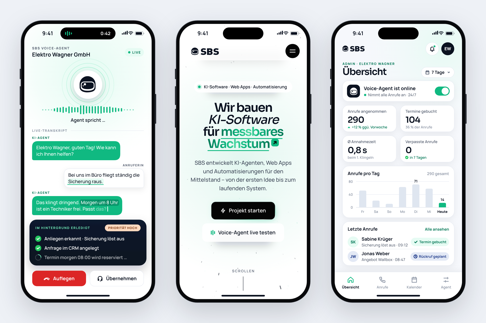

# SBS-Handy-Screens für die Hero-Section

Drei Handy-Screens als SVG, alle im selben Design (gleiches Gerät, gleiche Statusleiste, SBS-Farben, Sora + Manrope). Claude Design kann sie direkt als Bilder in die Hero-Section setzen.



| Datei | Inhalt |
|---|---|
| `svg/01-voice-agent.svg` | **Voice-Agent im Live-Anruf.** Der SBS Voice-Agent nimmt für „Elektro Wagner GmbH“ einen Notdienst-Anruf an: Helm-Orb, Sprach-Balken, Live-Transkript, darunter die dunkle Karte „Im Hintergrund erledigt“ sowie „Auflegen“ und „Übernehmen“. |
| `svg/02-website.svg` | **Die SBS-Website mobil.** Der Hero „Wir bauen KI-Software für messbares Wachstum“, nachgebaut aus der Website: Texte, Schriftgrößen, Buttons und Sternenhintergrund. |
| `svg/03-admin-dashboard.svg` | **Admin-Dashboard.** Übersicht über die letzten 7 Tage: Status des Voice-Agents, vier Kennzahlen, „Anrufe pro Tag“ und „Letzte Anrufe“. |
| `svg/screen-only/*.svg` | Dieselben drei Screens ohne Gehäuse, für einen eigenen Geräterahmen. |
| `preview/*.png` | Vorschauen in doppelter Auflösung. |

## Technik

- **Maße:**
  - Gerät 423 × 874, Display 393 × 852 bei (15, 11) mit Eckenradius 55.
  - Die Variante ohne Gehäuse ist 393 × 852.
  - Die SVGs skalieren verlustfrei.
- **Text:** Der Text ist echter Text, nicht in Pfade umgewandelt. Sora und Manrope stecken als Teilmenge (WOFF2) in jeder Datei, deshalb sehen die Screens im Browser überall gleich aus. In Figma werden die gleichnamigen Google Fonts verwendet.
- **IDs:** Jede Datei hat eigene ID-Präfixe (`va-`, `web-`, `db-`, ohne Gehäuse `vas-`, `webs-`, `dbs-`). Alle sechs SVGs können also zusammen inline in einer Seite stehen.
- **Schatten:** Schatten innerhalb der Screens sind SVG-Filter. Einen Schatten unter dem ganzen Gerät gibt es nicht, den setzt die Hero-Section per CSS, z. B. `filter: drop-shadow(0 30px 40px rgba(11,18,32,.18))`.

## Inhalte

- „Elektro Wagner GmbH“, „Sabine Krüger“ und „Jonas Weber“ sind erfundene Beispiele.
- Alle Zahlen im Dashboard sind Platzhalter. Sie passen aber zusammen: Die Tage summieren sich auf 290 Anrufe, und 104 Termine sind 36 %.

## Neu bauen

```bash
cd sbs-hero-screens
PYTHON=/pfad/zu/python node tools/build.mjs   # Python braucht fonttools und brotli
```

- `tools/screens.js` enthält das Layout. Texte werden im Browser mit den echten Schriften gemessen, Zeilenumbrüche und Markierungen sitzen dadurch exakt.
- `tools/build.mjs` bettet die Schriften ein und schreibt SVGs und Vorschauen.
- Die Schriften kommen aus `../sbs-voice-film/fonts`, Logo und Helm aus `tools/sbs-logo-paths.js`.
